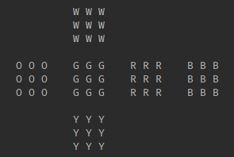
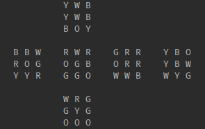

# RubiksCube

It based on rubik's cube model from https://rubiks-cube-solver.com/.

## You can show the cube in the console using `print()` method

Cube has 6 colors:
- White
- Orange
- Green  
- Red
- Blue
- Yellow




## You can make moves using this syntax:

```
// 3 is side length
Cube c = new Cube(3);
c.move(Cube.MOVES.UP);
```

`MOVES` is a static enumaration of the class `Cube`

`MOVES` contains:
- UP
- DOWN
- LEFT
- RIGHT
- FRONT
- BACK

and other 6 field with `R` in the beginning (Stands for **Reverse**)

## Example:

```
Cube c = new Cube(3);
c.move(Cube.MOVES.UP);
c.move(Cube.MOVES.RRIGHT);
c.print();
```

It will execute `U R'` and output the cube in console:


